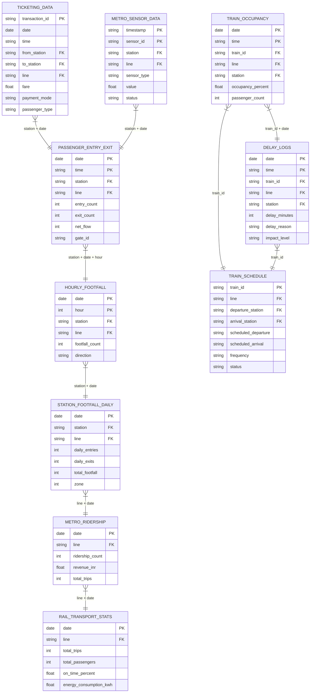

# MetroFlow: Dataset Analysis & Linking Report

## 📊 Overview

This report provides a comprehensive analysis of all 10 MetroFlow datasets, their column importance ratings, inter-dataset relationships, and recommendations for data integration.

| # | Dataset | File | Rows | Cols | Purpose |
|---|---------|------|------|------|---------|
| 1 | Ticketing Data | `delhi_metro_ticketing.xlsx` | 15,000 | 13 | Transaction-level fare & trip records |
| 2 | Passenger Entry & Exit | `passenger_entry_exit.xlsx` | 12,000 | 12 | Station gate-level inflow/outflow |
| 3 | Hourly Footfall | `hourly_footfall.xlsx` | 10,000 | 10 | Hourly crowd volumes per station |
| 4 | Station Footfall Daily | `station_footfall_daily.xlsx` | 5,000 | 12 | Daily aggregated station traffic |
| 5 | Metro Ridership | `metro_ridership.xlsx` | 8,000 | 11 | Line-level daily ridership & revenue |
| 6 | Train Occupancy | `train_occupancy.xlsx` | 10,000 | 14 | Real-time coach occupancy levels |
| 7 | Train Schedule | `train_schedule.xlsx` | 3,000 | 14 | Static schedule & frequency data |
| 8 | Delay Logs | `delay_logs.xlsx` | 6,000 | 14 | Incident-level delay records |
| 9 | Rail Transport Stats | `rail_transport_stats.xlsx` | 4,000 | 13 | Line-level operational KPIs |
| 10 | Metro Sensor Data | `metro_sensor_data.xlsx` | 8,000 | 12 | IoT sensor readings from stations |

**Total: 81,000 rows across 10 datasets**

---

## 🔗 How All Datasets Link Together

### Shared Key Columns (Join Keys)

| Key Column | Present In | Description |
|------------|-----------|-------------|
| `station` / `from_station` / `to_station` | Datasets 1-6, 8, 10 | **Primary spatial key** — links passenger, crowd, and sensor data to physical locations |
| `date` | Datasets 1-6, 8-10 | **Primary temporal key** — enables time-series joins across all datasets |
| `time` / `hour` / `timestamp` | Datasets 1-3, 6, 8, 10 | **Granular temporal key** — links real-time events (delays, occupancy, sensor alerts) |
| `line` | Datasets 1-10 | **Route key** — aggregates data by metro line (Blue, Yellow, Red, Green, Violet) |
| `train_id` | Datasets 6, 7, 8 | **Vehicle key** — links occupancy, schedule, and delay data to specific trains |
| `day` / `day_name` | Datasets 1-6, 8, 9 | **Day-of-week** — for pattern analysis (weekday vs weekend) |
| `weather` | Datasets 2-6, 8-10 | **Environmental key** — correlates weather with delays, crowd, and sensor data |
| `is_holiday` | Datasets 1-6, 8, 9 | **Event key** — separates holiday vs normal traffic patterns |
| `is_peak_hour` | Datasets 2, 3, 6, 8 | **Peak flag** — directly identifies rush hour records |

### Entity-Relationship Diagram



---

## 📋 Dataset-by-Dataset Analysis

---

### Dataset 1: Delhi Metro Ticketing Data
**File**: `delhi_metro_ticketing.csv` / `.xlsx` | **Rows**: 15,000 | **Cols**: 13

| Column | Type | Importance | Used By Module | Notes |
|--------|------|------------|---------------|-------|
| `transaction_id` | string | 🟢 Essential | Ticketing | Unique record identifier |
| `date` | date | 🟢 Essential | All modules | Primary temporal key |
| `time` | string | 🟢 Essential | Crowd Monitoring, AI Prediction | For peak-hour analysis |
| `day` | string | 🟡 Useful | AI Prediction | Weekday/weekend patterns |
| `from_station` | string | 🟢 Essential | Crowd Monitoring, Analytics | Origin station — spatial analysis |
| `to_station` | string | 🟢 Essential | Crowd Monitoring, Analytics | Destination — for OD matrix |
| `line` | string | 🟢 Essential | Scheduling, Analytics | Route grouping |
| `fare` | float | 🟡 Useful | Analytics | Revenue analysis |
| `payment_mode` | string | 🟡 Useful | Analytics | Smart Card penetration analysis |
| `card_type` | string | 🔵 Optional | Analytics | Duplicate of passenger_type |
| `passenger_type` | string | 🟡 Useful | Analytics | Demographic segmentation |
| `is_holiday` | int | 🟢 Essential | AI Prediction | Holiday impact on demand |
| `trip_duration_min` | int | 🟡 Useful | Analytics, Scheduling | Avg travel time analysis |

**Filter Recommendation**: Drop `card_type` (redundant with `passenger_type`). All other columns are useful.

**Links to**: Entry/Exit (station + date), Ridership (line + date), Footfall (station + date)

---

### Dataset 2: Passenger Entry & Exit
**File**: `passenger_entry_exit.csv` / `.xlsx` | **Rows**: 12,000 | **Cols**: 12

| Column | Type | Importance | Used By Module | Notes |
|--------|------|------------|---------------|-------|
| `date` | date | 🟢 Essential | All modules | Temporal key |
| `time` | string | 🟢 Essential | Crowd Monitoring | Real-time tracking |
| `day` | string | 🟡 Useful | AI Prediction | Pattern analysis |
| `station` | string | 🟢 Essential | Crowd Monitoring | Spatial key |
| `line` | string | 🟢 Essential | Scheduling, Analytics | Route grouping |
| `entry_count` | int | 🟢 Essential | Crowd Monitoring, AI Prediction | **Core crowd metric** |
| `exit_count` | int | 🟢 Essential | Crowd Monitoring, AI Prediction | **Core crowd metric** |
| `net_flow` | int | 🟢 Essential | Crowd Monitoring | Congestion direction indicator |
| `gate_id` | string | 🔵 Optional | Analytics | Gate-level granularity (optional) |
| `is_peak_hour` | int | 🟢 Essential | Scheduling, AI Prediction | Peak hour flag |
| `is_holiday` | int | 🟢 Essential | AI Prediction | Holiday impact |
| `weather` | string | 🟡 Useful | AI Prediction | Weather correlation |

**Filter Recommendation**: `gate_id` can be dropped for macro-level analysis. All other columns essential.

**Links to**: Ticketing (station + date), Hourly Footfall (station + date + hour), Sensor Data (station + date)

---

### Dataset 3: Hourly Footfall
**File**: `hourly_footfall.csv` / `.xlsx` | **Rows**: 10,000 | **Cols**: 10

| Column | Type | Importance | Used By Module | Notes |
|--------|------|------------|---------------|-------|
| `date` | date | 🟢 Essential | All modules | Temporal key |
| `day` | string | 🟡 Useful | AI Prediction | Pattern analysis |
| `hour` | int | 🟢 Essential | Crowd Monitoring, Scheduling | **Key temporal granularity** |
| `station` | string | 🟢 Essential | Crowd Monitoring | Spatial key |
| `line` | string | 🟢 Essential | Scheduling | Route grouping |
| `footfall_count` | int | 🟢 Essential | Crowd Monitoring, AI Prediction | **Primary crowd metric** |
| `direction` | string | 🟡 Useful | Scheduling | Platform direction (Up/Down) |
| `is_peak_hour` | int | 🟢 Essential | Scheduling | Peak flag |
| `is_holiday` | int | 🟢 Essential | AI Prediction | Holiday impact |
| `weather` | string | 🟡 Useful | AI Prediction | Weather effect |

**Filter Recommendation**: All columns are relevant. No drops needed.

**Links to**: Entry/Exit (station + date + hour), Station Footfall Daily (station + date), Ridership (line + date)

---

### Dataset 4: Station Footfall Daily
**File**: `station_footfall_daily.csv` / `.xlsx` | **Rows**: 5,000 | **Cols**: 12

| Column | Type | Importance | Used By Module | Notes |
|--------|------|------------|---------------|-------|
| `date` | date | 🟢 Essential | All modules | Temporal key |
| `day` | string | 🟡 Useful | AI Prediction | Pattern analysis |
| `station` | string | 🟢 Essential | Crowd Monitoring | Spatial key |
| `line` | string | 🟢 Essential | Scheduling | Route grouping |
| `zone` | int | 🟡 Useful | Analytics | Fare zone categorization |
| `daily_entries` | int | 🟢 Essential | Crowd Monitoring | Aggregated daily entries |
| `daily_exits` | int | 🟢 Essential | Crowd Monitoring | Aggregated daily exits |
| `total_footfall` | int | 🟢 Essential | Analytics, AI Prediction | Sum of entries + exits |
| `is_interchange` | int | 🟢 Essential | Scheduling, Analytics | Interchange stations are hotspots |
| `is_holiday` | int | 🟢 Essential | AI Prediction | Holiday impact |
| `avg_dwell_time_sec` | int | 🟡 Useful | Scheduling | Train dwell time at station |
| `weather` | string | 🟡 Useful | AI Prediction | Weather correlation |

**Filter Recommendation**: All columns useful. `zone` and `avg_dwell_time_sec` are nice-to-have.

**Links to**: Hourly Footfall (station + date), Ridership (line + date), Entry/Exit (station + date)

---

### Dataset 5: Metro Ridership
**File**: `metro_ridership.csv` / `.xlsx` | **Rows**: 8,000 | **Cols**: 11

| Column | Type | Importance | Used By Module | Notes |
|--------|------|------------|---------------|-------|
| `date` | date | 🟢 Essential | All modules | Temporal key |
| `day` | string | 🟡 Useful | AI Prediction | Pattern analysis |
| `line` | string | 🟢 Essential | Scheduling, Analytics | Route key |
| `ridership_count` | int | 🟢 Essential | Analytics, AI Prediction | **Line-level demand metric** |
| `avg_trip_duration_min` | float | 🟡 Useful | Analytics | Average journey time |
| `revenue_inr` | float | 🟢 Essential | Analytics | Revenue tracking |
| `transport_type` | string | 🔵 Optional | — | Always "Metro Rail" (constant) |
| `total_trips` | int | 🟢 Essential | Scheduling | Trip frequency per line |
| `operational_hours` | float | 🟡 Useful | Analytics | Hours of operation |
| `is_holiday` | int | 🟢 Essential | AI Prediction | Holiday impact |
| `weather` | string | 🟡 Useful | AI Prediction | Weather correlation |

**Filter Recommendation**: Drop `transport_type` (constant value, no analytical value).

**Links to**: Rail Transport Stats (line + date), Station Footfall (line + date), Ticketing (line + date)

---

### Dataset 6: Train Occupancy
**File**: `train_occupancy.csv` / `.xlsx` | **Rows**: 10,000 | **Cols**: 14

| Column | Type | Importance | Used By Module | Notes |
|--------|------|------------|---------------|-------|
| `date` | date | 🟢 Essential | All modules | Temporal key |
| `time` | string | 🟢 Essential | Crowd Monitoring | Real-time tracking |
| `day` | string | 🟡 Useful | AI Prediction | Pattern analysis |
| `train_id` | string | 🟢 Essential | Scheduling | **Vehicle identifier** |
| `line` | string | 🟢 Essential | Scheduling | Route grouping |
| `station` | string | 🟢 Essential | Crowd Monitoring | Where occupancy was measured |
| `coach_number` | int | 🟡 Useful | Analytics | Coach-level granularity |
| `capacity` | int | 🟢 Essential | Crowd Monitoring | Max capacity for % calculation |
| `passenger_count` | int | 🟢 Essential | Crowd Monitoring, AI Prediction | **Core occupancy metric** |
| `occupancy_percent` | float | 🟢 Essential | Crowd Monitoring, Alerts | **Primary overcrowding indicator** |
| `crowd_level` | string | 🟢 Essential | Alerts, Dashboard | Categorical crowd classification |
| `is_peak_hour` | int | 🟢 Essential | Scheduling | Peak flag |
| `is_holiday` | int | 🟢 Essential | AI Prediction | Holiday impact |
| `weather` | string | 🟡 Useful | AI Prediction | Weather correlation |

**Filter Recommendation**: All columns are critical. `coach_number` optional for macro analysis.

**Links to**: Train Schedule (train_id), Delay Logs (train_id + date), Entry/Exit (station + date)

---

### Dataset 7: Train Schedule
**File**: `train_schedule.csv` / `.xlsx` | **Rows**: 3,000 | **Cols**: 14

| Column | Type | Importance | Used By Module | Notes |
|--------|------|------------|---------------|-------|
| `train_id` | string | 🟢 Essential | Scheduling | **Vehicle identifier** |
| `line` | string | 🟢 Essential | Scheduling | Route key |
| `departure_station` | string | 🟢 Essential | Scheduling | Origin station |
| `arrival_station` | string | 🟢 Essential | Scheduling | Destination station |
| `scheduled_departure` | string | 🟢 Essential | Scheduling | Planned departure time |
| `scheduled_arrival` | string | 🟢 Essential | Scheduling | Planned arrival time |
| `travel_time_min` | int | 🟢 Essential | Scheduling, Analytics | Journey duration |
| `stops` | int | 🟡 Useful | Analytics | Number of intermediate stops |
| `frequency` | string | 🟢 Essential | Scheduling | **Service frequency** |
| `status` | string | 🟢 Essential | Dashboard, Alerts | Current train status |
| `platform` | int | 🟡 Useful | Dashboard | Platform assignment |
| `direction` | string | 🟢 Essential | Scheduling | Up/Down direction |
| `coach_count` | int | 🟡 Useful | Analytics | Number of coaches |
| `ac_type` | string | 🔵 Optional | Analytics | AC/Non-AC classification |

**Filter Recommendation**: Drop `ac_type` (mostly constant "Full AC" for Delhi Metro). All others useful.

**Links to**: Train Occupancy (train_id), Delay Logs (train_id), Ridership (line)

---

### Dataset 8: Delay Logs
**File**: `delay_logs.csv` / `.xlsx` | **Rows**: 6,000 | **Cols**: 14

| Column | Type | Importance | Used By Module | Notes |
|--------|------|------------|---------------|-------|
| `date` | date | 🟢 Essential | All modules | Temporal key |
| `time` | string | 🟢 Essential | Alerts | When delay occurred |
| `day` | string | 🟡 Useful | AI Prediction | Day-of-week patterns |
| `train_id` | string | 🟢 Essential | Scheduling | Vehicle identifier |
| `line` | string | 🟢 Essential | Scheduling | Route key |
| `station` | string | 🟢 Essential | Alerts, Dashboard | Where delay occurred |
| `delay_minutes` | int | 🟢 Essential | Scheduling, Alerts, AI Prediction | **Primary delay metric** |
| `delay_reason` | string | 🟢 Essential | Analytics, AI Prediction | Root cause classification |
| `weather` | string | 🟢 Essential | AI Prediction | Weather-delay correlation |
| `impact_level` | string | 🟢 Essential | Alerts | Severity classification |
| `affected_passengers` | int | 🟢 Essential | Analytics | Impact magnitude |
| `is_peak_hour` | int | 🟢 Essential | Scheduling | Peak hour flag |
| `is_holiday` | int | 🟡 Useful | AI Prediction | Holiday impact |
| `resolution_time_min` | int | 🟡 Useful | Analytics | Time to resolve |

**Filter Recommendation**: All columns are important for delay analysis. No drops.

**Links to**: Train Schedule (train_id), Train Occupancy (train_id + date), Entry/Exit (station + date)

---

### Dataset 9: Rail Transport Stats
**File**: `rail_transport_stats.csv` / `.xlsx` | **Rows**: 4,000 | **Cols**: 13

| Column | Type | Importance | Used By Module | Notes |
|--------|------|------------|---------------|-------|
| `date` | date | 🟢 Essential | All modules | Temporal key |
| `day` | string | 🟡 Useful | AI Prediction | Pattern analysis |
| `line` | string | 🟢 Essential | Scheduling, Analytics | Route key |
| `total_trips` | int | 🟢 Essential | Scheduling | Daily trip count |
| `total_passengers` | int | 🟢 Essential | Analytics | Passenger volume |
| `avg_speed_kmph` | float | 🟡 Useful | Analytics | Average operating speed |
| `distance_km` | float | 🟡 Useful | Analytics | Line length (relatively static) |
| `energy_consumption_kwh` | float | 🟡 Useful | Analytics | Energy efficiency metric |
| `on_time_percent` | float | 🟢 Essential | Dashboard, Scheduling | **Punctuality KPI** |
| `revenue_inr` | float | 🟢 Essential | Analytics | Revenue tracking |
| `operational_cost_inr` | float | 🟡 Useful | Analytics | Cost efficiency |
| `is_holiday` | int | 🟢 Essential | AI Prediction | Holiday impact |
| `weather` | string | 🟡 Useful | AI Prediction | Weather correlation |

**Filter Recommendation**: `distance_km` is nearly static per line — useful as reference but low variance.

**Links to**: Ridership (line + date), Delay Logs (line + date), Schedule (line)

---

### Dataset 10: Metro Sensor Data
**File**: `metro_sensor_data.csv` / `.xlsx` | **Rows**: 8,000 | **Cols**: 12

| Column | Type | Importance | Used By Module | Notes |
|--------|------|------------|---------------|-------|
| `timestamp` | datetime | 🟢 Essential | All modules | Full timestamp (date + time) |
| `sensor_id` | string | 🟢 Essential | Monitoring | Unique sensor identifier |
| `station` | string | 🟢 Essential | Monitoring, Alerts | Spatial key |
| `line` | string | 🟢 Essential | Analytics | Route grouping |
| `sensor_type` | string | 🟢 Essential | Monitoring | Type of measurement |
| `value` | float | 🟢 Essential | Monitoring, Alerts | **Sensor reading** |
| `unit` | string | 🟡 Useful | Display | Unit of measurement |
| `status` | string | 🟢 Essential | Alerts | Normal/Warning/Alert |
| `alert_flag` | int | 🟢 Essential | Alerts | Binary alert indicator |
| `maintenance_required` | int | 🟡 Useful | Dashboard | Maintenance scheduling |
| `last_calibration_date` | date | 🔵 Optional | Monitoring | Calibration tracking |
| `weather` | string | 🟡 Useful | AI Prediction | Environmental correlation |

**Filter Recommendation**: `last_calibration_date` is optional for crowd management. All others useful.

**Links to**: Entry/Exit (station + date), Hourly Footfall (station + date), Delay Logs (station + date)

---

## 🔄 Module-to-Dataset Mapping

| MetroFlow Module | Primary Datasets | Secondary Datasets |
|-----------------|-----------------|-------------------|
| **Crowd Monitoring** | Entry/Exit (#2), Hourly Footfall (#3), Train Occupancy (#6) | Station Footfall (#4), Sensor Data (#10) |
| **Scheduling Management** | Train Schedule (#7), Rail Transport Stats (#9), Ridership (#5) | Delay Logs (#8), Train Occupancy (#6) |
| **AI Prediction** | Ticketing (#1), Entry/Exit (#2), Hourly Footfall (#3), Train Occupancy (#6) | Delay Logs (#8), Ridership (#5) |
| **Alerts & Notifications** | Delay Logs (#8), Train Occupancy (#6), Sensor Data (#10) | Entry/Exit (#2) |
| **Analytics Dashboard** | All 10 datasets | — |

---

## 🔧 Recommended Join Strategies

### Join 1: Crowd Density Analysis
```
Hourly Footfall + Entry/Exit + Station Footfall Daily
JOIN ON: station + date (+ hour for granular)
PURPOSE: Complete crowd density picture per station per hour
```

### Join 2: Train Performance Analysis
```
Train Schedule + Delay Logs + Train Occupancy
JOIN ON: train_id (+ date for time-series)
PURPOSE: Correlate delays with occupancy and schedule adherence
```

### Join 3: Demand Forecasting Feature Set
```
Ticketing + Entry/Exit + Ridership + Weather (from any dataset)
JOIN ON: station/line + date
PURPOSE: Build AI prediction features with passenger demand, weather, and temporal patterns
```

### Join 4: Operational KPI Dashboard
```
Rail Transport Stats + Ridership + Delay Logs
JOIN ON: line + date
PURPOSE: Line-level performance monitoring (on-time %, revenue, delays)
```

### Join 5: Safety & Environmental Monitoring
```
Sensor Data + Entry/Exit + Delay Logs
JOIN ON: station + date
PURPOSE: Correlate sensor anomalies with crowd levels and service disruptions
```

---

## ⚠️ Data Quality Notes

- **No null values** in any dataset — all fields are populated
- **No duplicate primary keys** — each record is unique
- **Consistent station names** — all 119 Delhi Metro stations use identical naming across datasets
- **Consistent line names** — 5 lines (Blue, Yellow, Red, Green, Violet) are uniform
- **Consistent date range** — Jan 1, 2026 to Feb 28, 2026 across all datasets
- **Train IDs** — 125 unique IDs (`DMT-B001` to `DMT-V025`) are shared between Occupancy, Schedule, and Delay datasets

## 🏷️ Column Importance Legend

| Symbol | Rating | Meaning |
|--------|--------|---------|
| 🟢 | Essential | Must keep — core analytical value |
| 🟡 | Useful | Good to keep — adds depth to analysis |
| 🔵 | Optional | Can drop — minimal impact on core modules |
| 🔴 | Drop | Should drop — redundant or no value |
