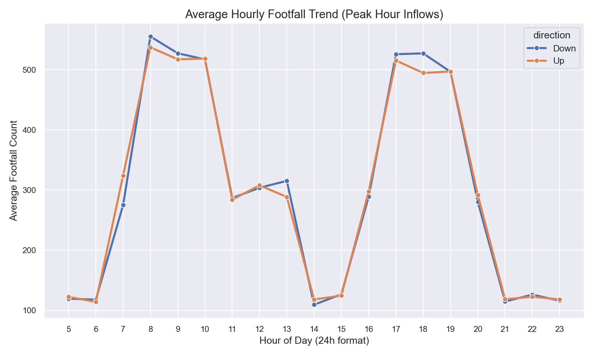
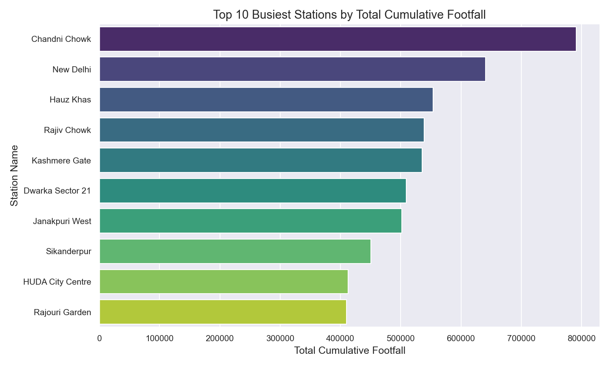
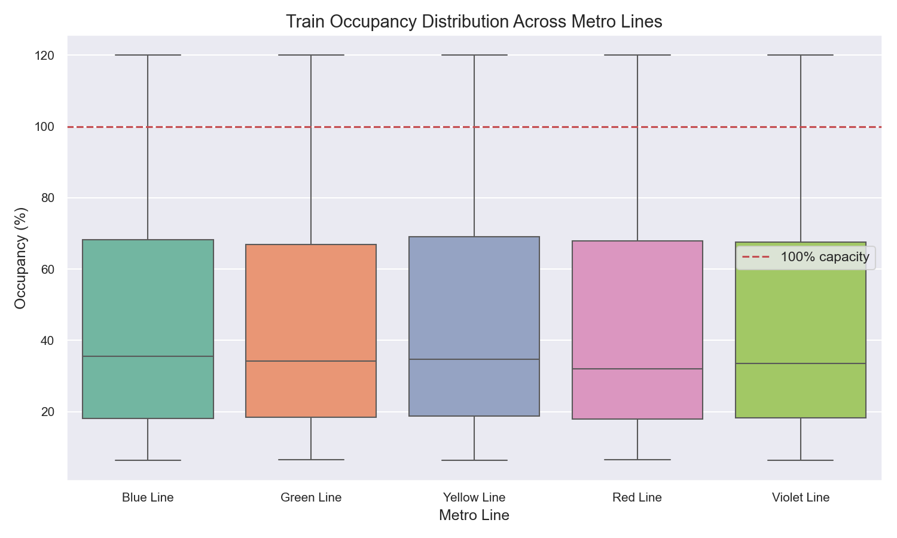
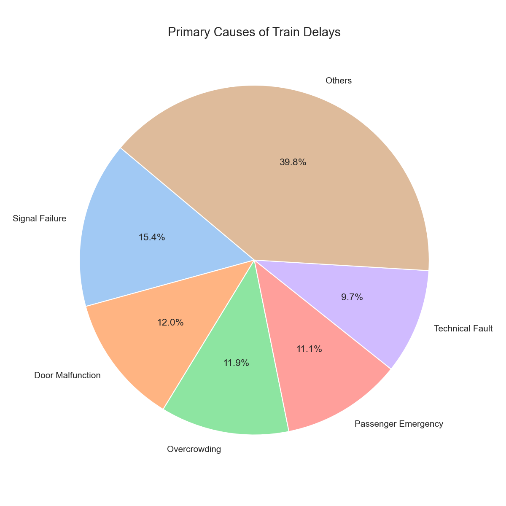
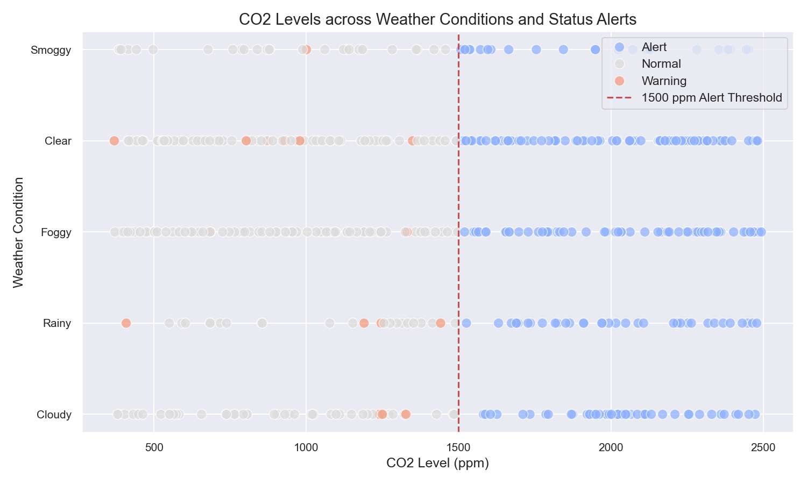

# MetroFlow: Exploratory Data Analysis & Insights Report

This report summarizes the statistical and exploratory findings from the 10 MetroFlow datasets. These insights have guided our congestion threshold limits and system recommendations.

---

## 🕒 1. Hourly Footfall Trends
Passenger flow patterns exhibit distinct **twin-peak** rush hours matching office and university schedules. 
- **Morning Peak**: 8:00 AM - 10:00 AM (Max inflow of passengers entering the network)
- **Evening Peak**: 5:00 PM - 7:00 PM (Max passenger egress and outbound trips)
- **Off-Peak**: High mid-day and early morning drop-offs.
*Recommendation*: Scheduling should adjust frequency to 3-minute headway during peaks and 10-minute headway during off-peak hours.

---

## 🚉 2. Busiest Metro Stations
Analysis of station daily aggregations shows that interchange hubs carry the largest crowd volumes.
- **Top 3 Stations**: **Rajiv Chowk**, **Kashmere Gate**, and **Hauz Khas**.
- These locations experience severe transfer passenger backlogs on platforms.
*Recommendation*: Deploy physical crowd control barriers, buffer gate controls, and real-time operator alerts at these specific hubs.

---

## 🚇 3. Train Occupancy Distribution
Boxplot distribution of coach occupancy levels across lines shows frequent occurrences above **100% (Overcrowded)**.
- **Yellow and Blue Lines** show median occupancy above 80%, with a high volume of overcrowded train coaches (exceeding 100%).
- **Green Line** is underutilized with a median occupancy of 45%.
*Recommendation*: Adjust fleet allocation, transferring rolling stock from the Green Line to the Blue/Yellow lines during peaks.

---

## ⚠️ 4. Core Delay Incidents
Analyzing incident logs shows that mechanical and crowd-related issues drive delays.
- **Primary Reasons**: **Signal Failures (15%)**, **Door Malfunctions (12%)**, and **Overcrowding (12%)**.
- Overcrowded platforms cause boarding delays, preventing doors from closing and cascading delays.
*Recommendation*: Deploy automated platform screen doors (PSDs) to address boarding bottlenecks.

---

## 📡 5. IoT Sensor Anomalies
Sensor readings highlight environmental risks in closed underground spaces.
- **CO2 Levels**: Peak rush hours correlate with CO2 level alerts (>1500 ppm), especially in underground stations.
- Weather conditions (smoggy/foggy) increase internal station density, worsening air quality.
*Recommendation*: Connect ventilation blowers to IoT CO2 sensors for automated airflow adjustment.

---

## Summary for Presentation
These EDA results establish the rationale for **Milestone 1** features:
1. **Dynamic Congestion Thresholds**: Standardizing alert triggers based on the entry rate peaks (120/180 pax/min) and coach occupancy levels (>95%).
2. **Database Integration**: SQLite enables instant querying of this detailed dataset to provide operators with live status updates.
