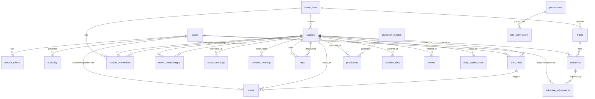

# Database Schema — ER Diagram & Reference

> **Last Updated:** July 7, 2026

---

## Entity-Relationship Diagram

---

## Table Summary

| # | Table | Records (Expected) | Purpose | Key Relations |
|---|-------|-------------------|---------|---------------|
| 1 | `users` | ~50 | Admin/operator/viewer accounts | → refresh_tokens, audit_log |
| 2 | `refresh_tokens` | ~200 | JWT refresh token storage | → users |
| 3 | `permissions` | ~16 | Resource-action permission definitions | → role_permissions |
| 4 | `role_permissions` | ~30 | Maps roles to permissions | → permissions |
| 5 | `audit_log` | Millions | All user actions for compliance | → users |
| 6 | `metro_lines` | ~15 | Metro line definitions | → stations, trains |
| 7 | `stations` | ~300 | All metro stations with thresholds | → metro_lines |
| 8 | `station_connections` | ~600 | Network topology edges | → stations, metro_lines |
| 9 | `station_interchanges` | ~30 | Transfer points between lines | → stations |
| 10 | `trains` | ~200 | Fleet registry | → metro_lines |
| 11 | `schedules` | ~50K | Base timetable per train per station | → trains, stations |
| 12 | `schedule_adjustments` | ~5K/month | AI & operator schedule modifications | → schedules, users |
| 13 | `crowd_readings` | Millions | Real-time station occupancy snapshots | → stations |
| 14 | `turnstile_readings` | Millions | Per-turnstile granular data | → stations |
| 15 | `trips` | Millions | Origin-destination trip records | → stations |
| 16 | `alert_rules` | ~50 | Configurable threshold rules | → stations, users |
| 17 | `alerts` | ~10K/month | Generated alert records | → alert_rules, stations, users |
| 18 | `prediction_models` | ~20 | ML model registry | → predictions |
| 19 | `predictions` | Millions | AI forecast outputs | → prediction_models, stations |
| 20 | `weather_data` | ~100K/year | Weather readings linked to stations | → stations |
| 21 | `events` | ~500/year | Festivals, sports, strikes, holidays | → stations |
| 22 | `daily_station_stats` | ~100K/year | Pre-aggregated daily analytics | → stations |

---

## Database Triggers

| Trigger | Table | Event | What It Does |
|---------|-------|-------|-------------|
| `trg_users_updated_at` | users | BEFORE UPDATE | Auto-sets `updated_at` to NOW() |
| `trg_stations_updated_at` | stations | BEFORE UPDATE | Auto-sets `updated_at` to NOW() |
| `trg_metro_lines_updated_at` | metro_lines | BEFORE UPDATE | Auto-sets `updated_at` to NOW() |
| `trg_trains_updated_at` | trains | BEFORE UPDATE | Auto-sets `updated_at` to NOW() |
| `trg_schedules_updated_at` | schedules | BEFORE UPDATE | Auto-sets `updated_at` to NOW() |
| `trg_alert_rules_updated_at` | alert_rules | BEFORE UPDATE | Auto-sets `updated_at` to NOW() |
| `trg_crowd_density_level` | crowd_readings | BEFORE INSERT/UPDATE | Auto-computes `density_level` from `current_occupancy` vs station thresholds |
| `trg_auto_crowd_alert` | crowd_readings | AFTER INSERT | Auto-generates an overcrowding alert when density is high/critical (with 15-min cooldown) |
| `trg_update_line_station_count` | stations | AFTER INSERT/UPDATE/DELETE | Keeps `metro_lines.total_stations` in sync |

---

## Indexing Strategy

| Category | Index | Justification |
|----------|-------|--------------|
| **Lookups** | `idx_users_email` | Fast login by email |
| **Lookups** | `idx_stations_code`, `idx_stations_name` | Station search |
| **Spatial** | `idx_stations_location` (GIST) | Nearest-station queries |
| **Time-series** | `idx_crowd_station_time` | Dashboard: latest readings per station |
| **Time-series** | `idx_crowd_timestamp` | Global timeline queries |
| **Filtering** | `idx_alerts_status`, `idx_alerts_severity` | Active alert dashboard filtering |
| **Joins** | `idx_connections_from`, `idx_connections_to` | Network graph traversal |
| **Analytics** | `idx_daily_stats_station`, `idx_daily_stats_date` | Historical reports |
| **AI** | `idx_predictions_target_time` | Forecast lookups by time window |

---

## ENUMs Reference

| Enum | Values |
|------|--------|
| `user_role` | admin, operator, viewer |
| `user_status` | active, inactive, suspended |
| `station_layout` | elevated, underground, at_grade |
| `line_status` | operational, partial, suspended, maintenance |
| `train_status` | in_service, out_of_service, maintenance, reserved |
| `density_level` | low, moderate, high, critical |
| `alert_severity` | low, medium, high, critical |
| `alert_status` | active, acknowledged, resolved, expired |
| `alert_type` | overcrowding, delay, maintenance, emergency, weather, system |
| `ticket_type` | single, return, smart_card, tourist_card, pass |
| `day_type` | weekday, saturday, sunday, holiday |
| `adjustment_status` | proposed, approved, applied, rejected, expired |
| `weather_condition` | clear, rain, storm, fog, snow, heatwave |
