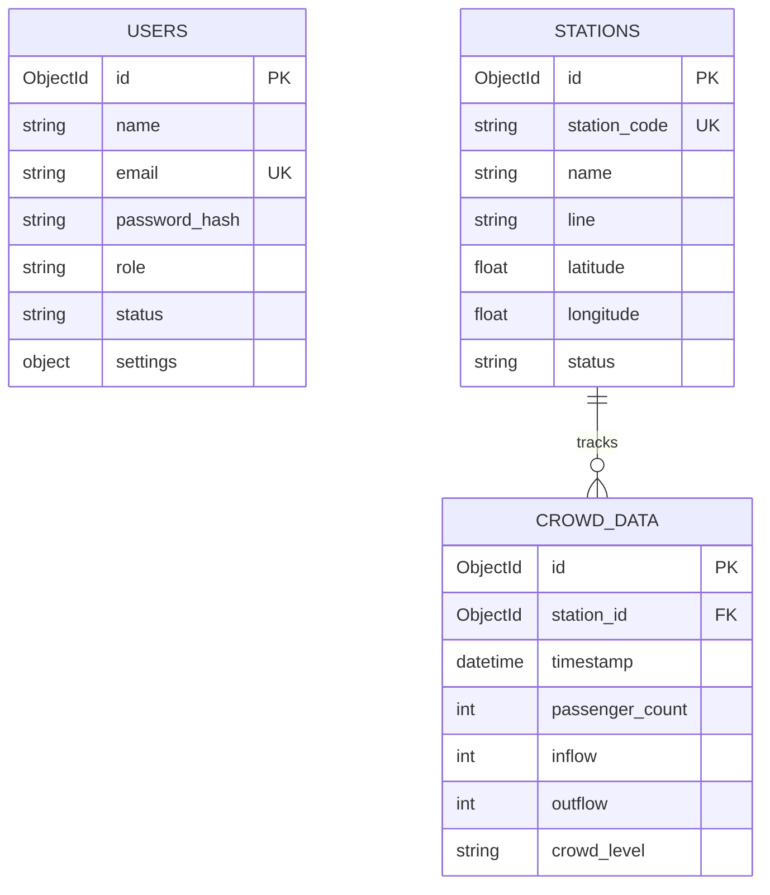

# Project Name: AI MetroFlow – AI Metro Crowd Management & Scheduling Platform

## Milestone 1: Week 1 & 2 — Project Initialization, Design Process & Core Setup

---

### System Architecture

The AI MetroFlow platform is designed using a modular, full-stack micro-architecture. By decoupling concerns, the project ensures scalability, clean maintainability, and clear separation of logic:

* **FastAPI Backend (`backend/`)**: Serves as the central API gateway. It handles request verification, authentication schemas, MongoDB communication via the asynchronous driver **Motor**, and broadcasts real-time simulation updates through WebSocket loops.
* **React + Vite Frontend (`frontend/`)**: Provides a responsive, glassmorphic operations console. It consumes backend REST endpoints via **Axios** and subscribes to state telemetries via a unified React Context provider.
* **Database Layer (`database/`)**: Governed by **MongoDB**, which supports dynamic schema storage for stations, real-time crowd metrics, fleet tracking, and logs.

This modular hierarchy improves development agility and ensures that future machine learning predictive pipelines can be plugged in without refactoring core components.

---

### User Interaction and Input Handling

User interaction is structured around a central web dashboard. To access the control panels, operators must authenticate via the portal:
* **Access Level Selection**: Operators select their clearance role (**Admin**, **Metro Operator**, or **Analyst**) using interactive selector buttons before logging in.
* **Auto-population**: When a developer clicks a profile selector card in development mode, the interface automatically loads the credentials, omitting them from plain-text visibility for safety.
* **Session Hydration**: On launch, the client checks `localStorage` for JWT credentials and validates them against the backend `/auth/profile` endpoint before rendering protected control panels.

---

### 1. Token Authentication & Role-Based Access Control

Staff registration and access management are controlled securely by the authentication router inside `backend/routers/auth.py` and helper routines inside `backend/auth.py`.

#### `backend/auth.py` – Cryptography & Token Signer
* **`hash_password(password: str) -> str`**: Encrypts raw operator passwords using `bcrypt` password hashing algorithms before writing to MongoDB.
* **`verify_password(plain_password: str, hashed_password: str) -> bool`**: Compares plain text credentials during login against stored database hashes.
* **`create_access_token(data: dict, expires_delta: Optional[timedelta]) -> str`**: Generates JSON Web Tokens (JWT) signed with `HS256` keys. Token payloads embed user emails and authorized roles.
* **`get_current_user(token: str)`**: Decodes active tokens and queries MongoDB to load the operator’s database entry. Includes a safe offline mock user fallback if connection timeouts occur.

#### `backend/routers/auth.py` – Authentication REST Endpoints
* **`register(user_in: UserRegister)`**: Validates inputs, checks for email duplicates, and inserts a new staff document.
* **`login(form_data: OAuth2PasswordRequestForm)`**: Checks passwords, matches selected operational roles, and returns a signed access token.
* **`get_profile()`**: Returns active operator profile metadata.
* **`change_password(pass_in: PasswordChange)`**: Allows authenticated operators to securely change passwords.

> [!NOTE]
> **Why this design is secure**: 
> * Storing raw passwords in database collections is a critical vulnerability; `bcrypt` hashes are computationally secure against brute-force attacks.
> * Checking the selected role against the user's registered database role prevents cross-role token hijacking.

---

### 2. MongoDB Database Design & Indexing

The data layer is configured inside `backend/database.py`, seeding collections and enforcing data integrity constraints on startup:

* **`users` Collection**: Stores operator information.
  * **Primary Key**: `_id` (ObjectId)
  * **Index**: Unique index on `email` to block duplicate account registrations.
* **`stations` Collection**: Stores metro station metadata parsed from Delhi Metro CSV network charts.
  * **Primary Key**: `_id` (ObjectId)
  * **Indexes**: 
    * Unique index on `station_code` for rapid O(1) identification.
    * Geospatial index `[("latitude", 1), ("longitude", 1)]` to support future proximity searches.
* **`crowd_data` Collection**: Logs passenger inflows, outflows, and waiting counts.
  * **Primary Key**: `_id` (ObjectId)
  * **Index**: Compound index `[("station_id", 1), ("timestamp", -1)]` to optimize historical timeline tracking.

---

### 3. Real-Time Crowd Monitoring & Telemetry

Crowd densities are monitored through dynamic dashboard components and persistent data streams:

#### `backend/database.py` – `seed_crowd_data(db)`
Simulates peak-hour passenger surges (8:00-10:00 and 17:00-19:00) using historical traffic distributions to seed realistic simulation points.

#### Density Level Classifications:
* **0% – 40% (Green)**: Low station occupancy. Passenger flows are unimpeded.
* **41% – 60% (Yellow)**: Moderate station occupancy. Normal operating status.
* **61% – 80% (Orange)**: High station density. Operators advised to standby for schedule headway adjustments.
* **81% – 100% (Red)**: Critical congestion. System generates alerts to redirect traffic.

#### Dashboard Components:
* **Metrics Cards**: Displays Total Stations, Total Passenger volume, Active Stations, and System Congestion ratios.
* **Telemetry Table**: Renders station occupancy list, passenger tallies, percentage splits, and last-updated timestamps.
* **Visualization Charts**: Implements Recharts components representing Passenger trends, Station distributions, and Congestion aggregates.

---

### 4. Frontend Routing & Layout Composition

The UI is built as a Single Page Application (SPA) inside `frontend/src/App.jsx` secured by custom guard components:

* **`PrivateRoute`** ([PrivateRoute.jsx](file:///d:/Projects/Tejavardhan/AI_MetroFlow/frontend/src/components/PrivateRoute.jsx)): Evaluates authentication tokens. Unauthenticated visits are immediately redirected back to `/login`.
* **`RoleRoute`** ([PrivateRoute.jsx](file:///d:/Projects/Tejavardhan/AI_MetroFlow/frontend/src/components/PrivateRoute.jsx)): Evaluates user roles against allowed scopes. Restricts administration settings, dispatches, and reports pages based on clearance levels.
* **`Unauthorized`** ([Unauthorized.jsx](file:///d:/Projects/Tejavardhan/AI_MetroFlow/frontend/src/pages/Unauthorized.jsx)): A landing page showing an access denied shield when role checks fail.
* **`NotFound`** ([NotFound.jsx](file:///d:/Projects/Tejavardhan/AI_MetroFlow/frontend/src/pages/NotFound.jsx)): Automatically handles all invalid path lookups on the client router.

---

### Outcomes and Deliverables Achieved

✔ **FastAPI API Framework**: Asynchronous routers, unified CORS rules, and automatic Swagger docs initialization.
✔ **MongoDB Motor Integration**: Automated connection setups, CSV parser seeders, and unique index declarations.
✔ **Secure Authentication**: Bcrypt password verification and signed JWT authorization tokens.
✔ **Dynamic RBAC Guard**: Component wrapper restricting actions based on Admin/Operator/Analyst roles.
✔ **Operations Center Console**: High-fidelity dark glassmorphic dashboard visualizing live telemetry metrics, alerts, and charts.
✔ **Docker Containerization**: Dockerfiles and Compose configurations designed for instant deployment.
